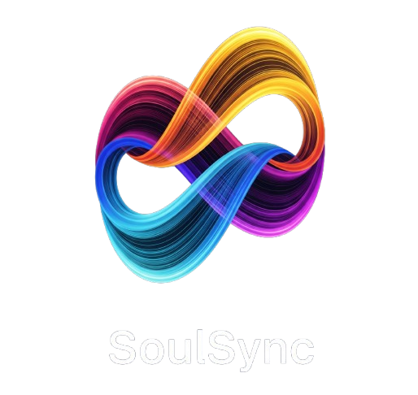

<p align="center">
  
</p>

# Commissary — Music & Video Automation for Self-Hosted Libraries

**Discovery, acquisition and library management for music *and* video, in one app.** Monitors artists and shows, curates playlists, fetches what's missing, tags and files it, and keeps a shared household install honest about who is allowed to do what.

> **Commissary is a fork of [SoulSync](https://github.com/Nezreka/SoulSync) by Nezreka.** It is not affiliated with, endorsed by, or supported by the upstream project. See [Relationship to SoulSync](#relationship-to-soulsync) before reporting a bug in either direction.

> **Before you start:** configure file sharing in slskd or you will be banned from Soulseek. Set up shared folders at `http://localhost:5030/shares`.

**Support**: [GitHub Issues on this repo](https://github.com/ThyMrMan/commissary/issues)

---

## Relationship to SoulSync

Commissary began as a private customization of SoulSync 3.1.5 and has diverged since. What that means in practice:

| | |
|---|---|
| **Upstream** | [Nezreka/SoulSync](https://github.com/Nezreka/SoulSync) — the original project, its Discord, and its `ssync.net` site. All of the credit for the foundation, and none of the blame for anything below. |
| **This fork** | [ThyMrMan/commissary](https://github.com/ThyMrMan/commissary), published as `ghcr.io/thymrman/commissary`. |
| **Versioning** | Independent. Commissary reset to `1.0.0` at the fork point, took the name at **2.0.0**, and is now **2.2.4**. Upstream's numbering (3.x) is unrelated, and the in-app update check points here, not there. |
| **Upstream fixes** | Pulled in selectively. Everything through SoulSync **3.1.8** was cherry-picked (released here as 1.6.0), and individually-triaged fixes from **3.2.0** landed in 1.9.19 and 1.9.22. |
| **Upstream features** | Not automatically adopted. SoulSync 3.2.0 is largely a React rewrite that deletes the vanilla-JS pages this fork has customized most heavily, so it is deliberately not followed. |
| **Where to report** | Bugs you see in Commissary belong **here**. Upstream cannot reproduce changes made in this fork, and several subsystems now behave differently on purpose. |

Under the hood the app still identifies itself as `soulsync` in a few places that are **data, not branding** — the config path and `SOULSYNC_*` environment variables, the `soulsync` standalone-server value stored in your library rows, the `soulsync_database` Docker volume, and the Navidrome/Subsonic client name your "Report Real Path" player setting hangs off. Renaming those would break existing installs for no gain, so they were left alone.

---

## What's Different in This Fork

Roughly 145 commits of changes since the fork point. The themes:

### Shared, multi-user installs

The single biggest divergence. Upstream assumes one operator; Commissary assumes a household.

- **Ask, don't fetch.** A profile without download rights can request a movie, show or episode. It lands on the watchlist/wishlist immediately marked *Awaiting approval*, visible to the requester, and **every** acquisition path skips it until an admin approves — the hourly drain, RSS sync, "Search now", "Search all missing" and the YouTube worker all filter on it.
- **Approval notifications.** A dedicated `video_request_pending` event fires only when something actually needs an admin, so a Discord/Telegram subscription isn't buried under every automated add. One message per request, carrying the count.
- **The account switcher no longer lets anyone in.** Selecting a profile now requires that this browser has actually authenticated as it (Plex sign-in, password, PIN, or credential reset). Previously any Plex-provisioned profile — which is created with neither PIN nor password — was one click away for anybody who reached the screen.
- **Sessions survive closing the browser** — permanent cookie with a sliding 30-day window, and logout now clears the whole session rather than just the active profile.
- **Admin-controlled UI per profile.** Per-card dashboard visibility, sidebar entries, and the floating help button, enforced as page-level access rather than CSS. A hidden card's fetches and refresh timers never start.
- **Per-user dashboard layout.** Anyone can drag to reorder cards and set them 1–3 columns wide, saved per side as deltas so a later release's new card still appears.
- **Permission gaps closed.** Clear-history, cancel-all, cancel-task and the entire import surface were reachable by any signed-in profile and operated on *shared* data. All gated, with the frontend hiding what would 403.

### Multiple libraries per content kind

- **Music Libraries** — music had exactly one output folder since its Soulseek-era design. It now has a table of labelled destinations, each able to override the naming template and quality profile, resolved per file (explicit choice → the item's own library → the library containing the file → the default → the legacy `transfer_path`). Seeded from your existing folder, so an install that never opens the setting writes files exactly where it always did.
- **Video Libraries everywhere** — the root-folders registry now drives health checks, the recycle bin, path resolution and the naming-conformance job, not just download destinations. Wishlist, watchlist, download history, enrichment priority and the library tab bar are all per-Library, with per-Library trackers and categories.
- **Anime stops leaking into TV.** A show you don't own yet had no Library, fell back to the primary, imported there, and the next scan made the mistake permanent. Intent can now be recorded on the watchlist *before* the first grab, and all nine wishlist-creating paths resolve a Library instead of nine of them meaning "primary".
- **A quality profile for a whole Library, not one title at a time.** Setting the same profile on every show in a Library meant opening every show. A Library now carries a default that anything inside it inherits, with a per-title override that still wins — and the per-title dropdown names the inherited profile rather than saying "Default" and leaving you to guess.
- **Writability probes** on both music and video destinations — an unwritable folder is marked *NOT WRITABLE* with the reason, instead of every track reporting a successful import while nothing moved.

### Acquisition you can drive by hand

- **Search every source and pick.** Manual search covers every *configured* source, not just the ones in your download chain, reachable from the Search page, album track rows (missing and owned), wishlist rows, and the download-missing modal. Clicking a search result now opens the picker by default; the old one-click cascade moved to a quieter "Auto" button.
- **Album release picker** — choose the actual release for a whole album, including Prowlarr-backed torrent/usenet releases, with the pick travelling as an opaque token rather than a download URL.
- **Manual import that doesn't require a failed download first**, with a folder browser instead of typing absolute paths, season-folder imports, and placement moved to a worker thread so a slow SMB copy stops reporting itself as a failure.
- **Season packs import.** Grabbing a pack used to download it and then leave it sitting; members are now fanned out and handed to the single-episode importer, inheriting per-episode upgrade decisions.
- **Explicit and clean versions told apart on the sources that know.** "Prefer explicit versions" only ever read the marker out of a *filename*, so it did nothing on Deezer, Tidal, Qobuz or HiFi — which report the answer directly and were having it discarded. It now compares against the track you asked for, only asks the question when that track is itself explicit, and only re-orders: a clean cut still downloads when it is all there is.
- **Rar'd releases are recognised before they wedge.** A torrent that turns out to be a set of `.rar` parts used to download and then sit there forever, since nothing on the video side extracts archives. The file list is now read before and after the grab, and a packed release says so instead of stalling silently.
- **Trackers you deselect are actually not searched** — the per-Library selection was a +25 scoring nudge while Prowlarr was still asked to search everything.

### Naming and organization

- **Sonarr/Radarr `{Token}` naming** alongside the existing `$variable` scheme, including optional groups, split brackets and `:spec` padding — so a TRaSH-guides format string works copy-pasted. All four documented schemes are pinned verbatim in the tests. Nothing existing moves; adoption is a one-click preset.
- **Rename Files from a title's own page**, with every variable shown alongside the value it takes for *that* title and a live before/after preview.
- **Reorganize preserves what you curated** — your casing, your album year and your disc layout survive a re-match against a metadata source that disagrees.
- **A rename can no longer lose what it cannot rebuild.** Tokens that only exist at import are named and the file is skipped, rather than a shorter "canonical" name being proposed and approved.

### Purchased tracking

A permanent record when a track or album is bought, with its own sidebar page, album-level marking, and collapsible albums. Recording a purchase is open to every profile; *unmarking* one destroys history nothing can rebuild, so it is admin-only and enforced server-side.

### Security

A full review before exposing the app beyond a LAN — 1100 routes, 543 of them state-changing:

- **CSRF protection** on every state-changing route, via Origin/Referer validation. On by default.
- **Pre-auth API key minting closed.** `/api/v1/api-keys/bootstrap` issued a working key with no authentication at all, which could then be used to turn login off entirely.
- **SSRF fixed** in the image proxy, whose allow-check was structurally always true — it would fetch loopback, link-local and RFC1918 addresses on request.
- **Indexer download URLs never reach the browser** (adopted from upstream 3.1.6) — they carried indexer API keys into DevTools and let a client make the app forward an arbitrary URL to its download client.

Audited and found clean: SQL injection, command injection, unsafe deserialization, password storage, and brute-force limiting.

### Removed

**Chat** (Soulseek rooms and DMs) is gone entirely — blueprint, modules, page, nav and the message-this-user buttons — along with the upstream donation button. The app also now identifies itself to Plex with a persisted client identifier, so it stops appearing as a brand-new device after every container restart.

### Reliability

Fixes found by reading real 12-hour logs rather than from reproductions: Deezer silently dying on an expired CSRF token and never recovering while still reporting itself healthy; HiFi re-dialling instances it already knew were down (4,094 errors in one log, now cooled down per instance); episodes filed under the wrong show entirely because a name search accepted `results[0]`; a leaked worker slot hanging an entire album; batch healing that counted *completed* tracks as orphans; downloaded songs never reaching the playlist that requested them.

More of the same, from later logs:

- **A batch that could never finish counting its own workers.** Two lists of "still working" statuses disagreed, and the one the watchdog used omitted `pending` — the status every task is *created* with. So a worker it had just started was invisible to it: it freed a slot still in use, started a replacement that was equally invisible, and repeated every few seconds. The miscounts drove the count below zero and the completion test asked for exactly zero. There is one shared definition now, the count cannot go negative, and the completion test no longer depends on it landing exactly.
- **Say where a video file went, and why a grab was refused.** Both used to be silent; a refused grab now names its reason and an import names its destination.
- **A duplicate add is not a failure.** Handing a torrent client something it already had was being treated as a refusal; it now adopts the existing torrent.
- **Two modules that decided whether a batch completes were logging to the console only** — outside the namespace the log file listens on, so 2.7 MB of a real log contained not one line from them while five batches hung. Diagnosing that took a source read where it should have taken a log read.
- **Download source settings that saved and then reverted.** Rearranging your sources appeared to save and came back the way it was on the next page load. The save was fine; the step that ran after it re-read the stored list and wrote the old arrangement back on top. The sidebar quick-switch had the same cause and was inert for downloads entirely.

### Distribution

Published to **GitHub Container Registry** as `ghcr.io/thymrman/commissary`, manual-dispatch only — publishing is a release decision, not something every push to `main` does. There is no Docker Hub image and no nightly channel.

---

## Install

### Docker (recommended)

```bash
curl -O https://raw.githubusercontent.com/ThyMrMan/commissary/main/docker-compose.yml
docker-compose up -d
# Access at http://localhost:8008
```

The compose file pulls `ghcr.io/thymrman/commissary:latest`. To pin a release, change the `image:` line to a version tag:

```bash
docker pull ghcr.io/thymrman/commissary:2.2.4
```

`:latest` and `:<version>` are the only tags. Images are built for `linux/amd64` and `linux/arm64`.

> The compose file's service, container, network and **volume** names deliberately still say `soulsync`. Renaming the named volume would point a running install at an empty database.

### Unraid

Install the template from:

```
https://raw.githubusercontent.com/ThyMrMan/commissary/main/templates/commissary.xml
```

PUID/PGID are exposed — set them to match your Unraid permissions (default 99/100 for nobody/users). See [Support/UNRAID.md](Support/UNRAID.md) for the full guide.

### Python (no Docker)

```bash
git clone https://github.com/ThyMrMan/commissary
cd commissary
python -m pip install -r requirements.txt

# Build the React WebUI bundle the Python server serves.
# Docker does this automatically; Python installs must do it manually.
cd webui
npm ci
npm run build
cd ..

gunicorn -c gunicorn.conf.py wsgi:application
# Open http://localhost:8008
```

Python 3.11 and Node 24 (see `.tool-versions`). Rebuild the WebUI after every `git pull` — if `webui/static/dist/.vite/manifest.json` is missing or stale, React-owned routes won't load correctly.

**YouTube streaming / music videos** need two extra things on bare-metal installs (Docker bundles both):

- **Deno** — yt-dlp requires a JavaScript runtime to unlock YouTube formats. Without it, streams and music-video downloads fail with `Requested format is not available`. Install with `winget install DenoLand.Deno` (Windows) or see [deno.com](https://docs.deno.com/runtime/), then restart.
- **yt-dlp nightly** — the stable release can lag months behind YouTube changes: `python -m pip install -U --pre "yt-dlp[default]"`

### Local development

Only for working on the WebUI with hot reload. Normal installs build once with `npm run build` and run only Gunicorn.

Two terminals, so the backend and Vite stay independent:

1. Backend — `python -m pip install -r requirements-dev.txt` then `gunicorn -c gunicorn.dev.conf.py wsgi:application` (this config watches backend files and restarts on change).
2. Frontend — `cd webui && npm ci && npm run dev`.

`python dev.py` starts both halves together on any OS; `./dev.sh` is the Unix shell wrapper.

Tests: `python -m pytest`. On Windows expect **15 known failures** (path-separator, ffmpeg-presence and file-permission tests) — that is the documented baseline, not a regression.

---

## Setup Guide

### Prerequisites

- **slskd** running and reachable ([releases](https://github.com/slskd/slskd/releases)) — required for Soulseek downloads
- **Prowlarr** — required for the video side's torrent/usenet sources
- **Spotify API** credentials ([dashboard](https://developer.spotify.com/dashboard)) — optional but recommended for music discovery
- **TMDB** API key — required for anything on the video side
- **Media server** (optional): Plex, Jellyfin, or Navidrome. Music also runs standalone with no media server at all.
- **Deno** (Python/no-Docker installs only) — see above
- **Deezer ARL token / Tidal account / Qobuz account** (optional) — for those download sources

### Step 1: slskd

1. Add an API key in slskd's `settings.yml` under `web > authentication > api_keys`
2. Restart slskd
3. Paste the key into Settings → Downloads → Soulseek

**Configure file sharing in slskd to avoid Soulseek bans.** Set up shared folders at `http://localhost:5030/shares`.

### Step 2: Spotify (optional)

1. Create an app at [developer.spotify.com/dashboard](https://developer.spotify.com/dashboard)
2. Add redirect URI `http://127.0.0.1:8888/callback`
3. Copy the Client ID and Secret into Settings

More detail in [Support/DOCKER-OAUTH-FIX.md](Support/DOCKER-OAUTH-FIX.md).

### Step 3: Paths

Open Commissary at `http://localhost:8008` and go to Settings.

- **Download source**: Soulseek, Deezer, Tidal, Qobuz, HiFi, Amazon Music, YouTube — or several, as one ordered chain
- **Input folder**: the container path to slskd's download folder (e.g. `/app/downloads`)
- **Music Libraries**: one or more labelled output destinations (e.g. `/app/Transfer`)
- **Import folder**: optional, for importing existing music (e.g. `/app/Staging`)
- **Video Libraries**: one or more per kind under Settings → Connections (e.g. separate `Movies` / `Anime Movies`, `TV` / `Anime`)
- **Media server** (optional): use your machine's real IP, not `localhost` — that means inside the container

### Step 4: Docker path mapping

| What | Container path | Host path |
|------|---------------|-----------|
| Config | `/app/config` | Your config folder |
| Logs | `/app/logs` | Your logs folder |
| Database | `/app/data` | Named volume (recommended) |
| Input | `/app/downloads` | The same folder slskd downloads to |
| Music output | `/app/Transfer` | Where organized music goes |
| Import | `/app/Staging` | Optional, for importing music |
| Video output | `/media/movies`, `/media/tv`, `/media/youtube` | Where Plex/Jellyfin reads from |

**Use a named volume for the database** (`soulsync_database:/app/data`). A direct host mount at `/app/data` can overwrite Python module files.

### Exposing it beyond your LAN

CSRF protection is on by default, but three things are configuration rather than code:

1. `security.require_login` **must** be on — without it an unauthenticated request resolves to profile 1, which is admin
2. TLS, with `trust_reverse_proxy` enabled — see [Support/REVERSE-PROXY.md](Support/REVERSE-PROXY.md)
3. Run under gunicorn, not `python web_server.py`

---

## Features

### Discovery

**Release Radar** — new tracks from watchlist artists, personalized by listening history

**Discovery Weekly** — 50 tracks from similar artists with serendipity weighting

**Seasonal playlists** — Halloween, Christmas, Valentine's, Summer, Spring, Autumn (hemisphere-aware)

**Personalized playlists (12+ types)** — Recently Added, Top Tracks, Forgotten Favorites, Decade (1960s–2020s), Genre (15+ categories), Because You Listen To, Daily Mixes, Hidden Gems, Popular Picks, Discovery Shuffle, Familiar Favorites, plus a custom builder (1–5 seed artists → similar artists → random albums → shuffled tracks)

**Cache-powered discovery (zero API calls)** — Undiscovered Albums, New In Your Genres, From Your Labels, Deep Cuts, and a Genre Explorer with per-genre deep-dive modals (cached, so a repeat click isn't a 30-second scan)

**ListenBrainz** — import recommendation and community playlists

**Beatport** — full electronic integration with a 39+ genre browser

**Artist Map & Artist Web** — full-screen graph explorers of your library's taste landscape: every artist a node, clustered by genre, wired by similarity, plus a Playlist Explorer that renders any playlist as a tree

**Block from the row** — say "not this artist" from the track in front of you, anywhere on Discover

### Downloads

**11 sources**: Soulseek, Deezer, Tidal, Qobuz, HiFi, Amazon Music, YouTube, SoundCloud, Lidarr, and torrent + usenet via Prowlarr — configured as one ordered chain with automatic fallback. Every *configured* source is searchable by hand regardless of chain order.

- **Deezer** — ARL token auth, FLAC / MP3 320 / MP3 128 with quality fallback and Blowfish decryption
- **Tidal** — device-flow OAuth, AAC 96kbps through FLAC 24-bit/96kHz Hi-Res
- **Qobuz** — email/password, up to Hi-Res Max (FLAC 24-bit/192kHz)
- **HiFi** — free lossless via public instances, no account, with per-instance failure cooldowns
- **Soulseek** — FLAC priority, quality profiles, peer scoring, source reuse for album consistency
- **YouTube** — audio extraction with cookie-based bot-detection bypass
- **SoundCloud** — anonymous, no account, good for remixes and independent artists
- **Amazon Music** — account-based; the one source that cannot take part in explicit/clean preference, since it publishes no such flag
- **Lidarr** — hands the request to an existing Lidarr install rather than fetching directly
- **Torrent / usenet** — via Prowlarr, with the tracker that served each result named and linked. Both index whole releases rather than tracks, so they are grouped separately in the picker

**Playlist sources**: Spotify, Tidal, YouTube, Deezer, Qobuz, Beatport charts, ListenBrainz, Spotify/Deezer link paste (no API needed), CSV/TSV/M3U import. Discovery results can be filtered by match quality (Perfect / Low confidence / Wing It / Not found / Error).

**Post-download**: lossy copies (MP3/Opus/AAC), Hi-Res FLAC downsampling, synchronized lyrics via LRClib, optional ReplayGain, and Picard-style MusicBrainz release preflight so every track on an album gets the same release ID.

### Verification & metadata

**AcoustID fingerprinting** (optional) across all sources, catching wrong versions — live, remix, cover — even from streaming APIs. Fail-open: a verification error never blocks a download. Results are now sorted best-first with a 0.80 confidence floor rather than taking whatever the API listed first. Get a free key at [acoustid.org/new-application](https://acoustid.org/new-application) and paste it into Settings → AcoustID; without one, downloads still complete and verification is skipped silently.

**14 background enrichment workers**: Spotify, MusicBrainz, iTunes, Deezer, Discogs, AudioDB, Last.fm, Genius, Tidal, Qobuz, JioSaavn, Amazon, Bandcamp, Similar Artists — plus SoulID generation. Pause/resume from the dashboard, auto-paused during scans, re-read on a 30-second cache when idle rather than every 2 seconds.

**Multi-source metadata** — primary source selectable (Spotify, iTunes/Apple Music, Deezer, Discogs); Spotify no longer auto-overrides. **Genre whitelist** filters junk tags (artist names, radio shows, playlist names) with 272 curated defaults. **Hydrabase** (optional P2P metadata network) replaces iTunes when connected.

**Matching engine** — version-aware (strictly rejects remixes when you want the original, and vice versa), Unicode and accent handling (KoЯn, Bjork, A$AP Rocky), weighted fuzzy confidence, album variation detection (Deluxe, Remastered, Taylor's Version), short-title protection so "Love" never matches "Loveless".

### Automation

**Visual drag-and-drop builder** with triggers (schedule, daily/weekly, track downloaded, batch complete, playlist changed, discovery complete, signal received, library scan complete, watchlist match, wishlist item added) and 20+ actions. Signal chains let one automation fire another, with cycle detection, depth limits and cooldowns. **Pipelines** install a linked group in one click. **Groups** organize them.

**Watchlist** — unlimited artists with per-artist release-type and content filters, auto-discovery of similar artists, periodic scanning

**Wishlist** — failed downloads queued for retry with auto-processing and a real backoff ladder

**Mirrored playlists** — mirror from Spotify, Tidal, YouTube, Deezer and stay synced, with an Auto Wing It fallback for tracks no metadata API can identify, and an automatic re-sync once downloaded tracks actually become matchable

### Library management

**Dashboard** — service status, system stats, activity feed, enrichment worker controls, per-user layout

**Library page** — artist grid with per-artist enrichment coverage rings, Artist Radio, play buttons on Last.fm top tracks

**Enhanced Library Manager** — inline metadata editing, per-service manual matching, tag writing (MP3/FLAC/OGG/M4A) with diff preview, server sync after writes, bulk operations, multi-disc support, re-identify (staged through the import pipeline; the original is never deleted until the re-import succeeds), artist photo picker, Enhance Quality and Reorganize Album

**Library Maintenance** — Track Number, Dead Files, Duplicates, Metadata Gaps, Album Completeness, Missing Cover Art, AcoustID Scanner, Orphan Files, Fake Lossless, Library Reorganize, Lossy Converter, MBID Mismatch, Album Tag Consistency, Live/Commentary Cleaner — with a findings dashboard and one-click Fix All

**Import system** — tag-first matching, exact-ID identification (a Spotify link in the comment tag resolves 1:1; ISRC tags resolve by folder consensus), auto-grouped album cards, `.lrc` sidecars travelling with their tracks, and an Auto-Import worker whose confidence threshold is now a value it can actually reach

**Standalone mode** — run without Plex, Jellyfin or Navidrome; downloads and imports write straight to the library database, with a filesystem scanner for incremental and deep scans

**Live log viewer** on Settings → Logs — color-coded, filterable, switchable between log files, updating over WebSocket

### Player, stats and scrobbling

Built-in streaming player with queue, Now Playing modal with ambient glow and a Web Audio visualizer, Smart Radio auto-queue, repeat/shuffle, keyboard shortcuts and Media Session API. A full listening-stats dashboard (timeline, genre breakdown, top artists/albums/tracks, library health, storage). Automatic Last.fm and ListenBrainz scrobbling from Plex, Jellyfin or Navidrome.

### Mobile

Comprehensive mobile layouts across both sides — every music page plus the full video side, including both Studios.

---

## Video Library — Movies, TV Shows & YouTube

A fully isolated video side: its own database, dashboard, search, calendar and download pipeline, sharing the automation engine but never touching the music side. Works with **Plex** and **Jellyfin**.

**Libraries & scanning** — Movies and TV as independent libraries with three scan modes (incremental delta, deep re-read with prune, full reset), a smart post-download probe that skips the full crawl, weekly deep scans and an hourly incremental safety net.

**Metadata** — TMDB, TVDB (including an episode-metadata fallback) and OMDb ratings, plus **12 background enrichment workers**: fanart.tv, OpenSubtitles, Return YouTube Dislike, SponsorBlock, DeArrow, YouTube upload dates, Trakt, TVmaze, AniList, Wikidata, TMDB watch providers, MediaStinger. Enrichment is gap-fill by design — it fills what the server left blank and never clobbers server data, with per-field user locking. A rolling re-enrichment automation keeps ratings, overviews, art and air dates from going stale.

**Episode numbering that matches your server.** Providers disagree about season numbers — TMDB has Bleach as three seasons, TVDB as seventeen — and cascading one provider's numbers over the other's list invents episodes inside the wrong season. Commissary scores each provider on how much of *your server's* season structure it can serve, picks accordingly, and lets you override per show. Two repair jobs clean up rows already written.

**Discover** — Netflix-style billboard hero with real title-logo art, an endlessly lazy-loading rail stack (For You, Top 10 Today, "Because you like…", "On your streaming services", mood/studio/genre/decade/foreign), every rail opening as a paged See All grid, plus a browse filter bar and a Hide-owned toggle.

**Detail pages & search** — cinematic movie/show/person/studio pages with trailer autoplay, cast and crew, where-to-watch and similar titles; a Get modal with per-source Manual or Auto search; Play-on-Plex/Jellyfin deep links; Wishlist Missing for every missing aired episode; a Manage panel with per-field locks, per-service match editing, re-file, a per-title "also known as" override and an episode-numbering choice; a full-screen Poster Manager; and progressive search that streams results per group.

**TV Calendar** — a real 7-column week grid with time-band rows and a "Now" cue, a "Next up" billboard, and a scope toggle between your watchlist and the whole library.

**Watchlist → wishlist → download** — follow shows, actors/directors (their whole filmography), studios (with family presets: Disney = Pixar + Marvel + Lucasfilm), YouTube channels and playlists. Upcoming titles are wishlisted only within ~1 year of release, so the wishlist never fills with distant announcements.

**Downloads** — Soulseek (slskd), Prowlarr indexers (torrent + usenet) and YouTube (yt-dlp) as a reorderable chain; Radarr/Sonarr-class quality profiles with cutoff, upgrade-until-cutoff, reject rules and preferred-words scoring; a live downloads page with an expandable detail drawer and season-pack grouping; a permanent history archive; a release blocklist and a recycle bin. Files land **atomically and size-verified** — the importer stages to a temp name in the destination and does one `os.replace`, so a media server never indexes a half-copied file.

**Overlay Studio** — a visual overlay-template editor applied via Pillow directly onto Plex/Jellyfin posters, with per-scope assignments, a logo-badge system, nightly re-apply that skips unchanged items, and a job that reclaims the space poster re-uploads accumulate.

**Collection Manager** — build Plex Collections / Jellyfin BoxSets from smart filters and ranked lists (IMDb charts and lists, TMDB charts and lists, Trakt lists, MDBList) rendered in true rank order, with franchise auto-backfill and a nightly sync.

**YouTube** — follow channels and playlists as shows via yt-dlp with no API key (long-form only, Shorts excluded), import your subscriptions from a ytdl-sub/Kometa `subscriptions.yml`, per-channel keep windows and retention, and true downloaded-state tracking.

**Maintenance & issues** — broken files, duplicate movies, metadata gaps, missing episodes, naming conformance, quality upgrade, watched cleanup, wishlist audit, movie collections and YouTube ghosts; bulk metadata editing; an Issues page with a nav badge; and Tautulli-style Server Activity with live now-playing, history and graphs in an app-wide drawer.

---

## Architecture

**Scale** — ~400,000 lines across the Python backend and the JS/TS frontend, 1,000+ API endpoints, tested against 10,000+ album libraries

**Stack** — Python 3.11, Flask, SQLite (WAL mode), gunicorn. The frontend is a vanilla-JavaScript SPA in `webui/static` with React (Vite, TanStack Router/Query, Recharts) in `webui/src` for migrated routes — Import, Stats, Issues, artist and label detail. Charts on legacy pages are Chart.js.

**Integrations** — Spotify, iTunes/Apple Music, Deezer, Tidal, Qobuz, YouTube, Soulseek (slskd), Prowlarr, HiFi, Beatport, ListenBrainz, MusicBrainz, AcoustID, AudioDB, Last.fm, Genius, LRClib, music-map.com, TMDB, TVDB, OMDb, Trakt, fanart.tv, Plex, Jellyfin, Navidrome

**Core components**

- **Matching engine** — version-aware fuzzy matching with a streaming-source bypass
- **Source chain** — one ordered list of download sources, resolved through a single module so no two code paths can disagree about your configuration
- **Discovery system** — personalized playlists, cache-powered sections, seasonal content
- **Metadata pipeline** — 14 enrichment workers, Picard-style album consistency, dual-source fallback
- **Automation engine** — event-driven workflows with signal chains and pipeline deployment
- **SoulID** — deterministic cross-instance artist/album/track identifiers via track-verified API lookup
- **Video engine** — an isolated database, scanner, enrichment pool, quality ranker, fulfillment engine and import pipeline

---

## Comparison

| Feature | Commissary | Lidarr | Headphones | Beets |
|---------|-----------|--------|------------|-------|
| Custom discovery playlists (15+) | ✓ | ✗ | ✗ | ✗ |
| Cache-powered discovery (zero API) | ✓ | ✗ | ✗ | ✗ |
| Listening stats dashboard | ✓ | ✗ | ✗ | ✗ |
| Last.fm / ListenBrainz scrobbling | ✓ | ✗ | ✗ | ✗ |
| 11 download sources | ✓ | ✗ | ✗ | ✗ |
| Deezer / Tidal / Qobuz downloads | ✓ | ✗ | ✗ | ✗ |
| Soulseek downloads | ✓ | ✗ | ✗ | ✗ |
| Beatport integration | ✓ | ✗ | ✗ | ✗ |
| Audio fingerprint verification | ✓ | ✗ | ✗ | ✓ |
| 14 enrichment workers | ✓ | ✗ | ✗ | Plugin |
| Picard-style album tagging | ✓ | ✗ | ✗ | ✗ |
| Visual automation builder | ✓ | ✗ | ✗ | ✗ |
| Library maintenance suite (14 jobs) | ✓ | ✗ | ✗ | ✓ |
| Multi-profile with request approval | ✓ | ✗ | ✗ | ✗ |
| Movies / TV / YouTube in the same app | ✓ | ✗ | ✗ | ✗ |
| Built-in player + radio | ✓ | ✗ | ✗ | ✗ |

---

## Contributing

This fork tracks a single `main` branch. There is no `dev` branch and no nightly image — `.github/workflows/build-and-test.yml` runs ruff, `compileall`, `pytest` and the WebUI build on every branch except `main`, and `docker-publish.yml` publishes only on manual dispatch.

1. Fork and clone
2. Branch off `main`
3. Make your changes, with tests — the convention here is that a fix ships with a test that **fails when the fix is backed out**
4. Run `python -m pytest` (15 known Windows failures are the baseline) and, for frontend changes, `npm run check` and `npm run build` in `webui/`
5. Open a PR against `main`

Ruff config lives in `pyproject.toml`; the ruleset is intentionally lenient — real bugs (undefined names, import shadowing, closure-in-loop), not style nits. For web UI work see [webui/README.md](webui/README.md).

### A release touches four places

`web_server._SOULSYNC_BASE_VERSION` is the one the UI, update check and backup metadata actually read. `database/__init__.__version__`, the `version_tag` default in `docker-publish.yml` and the changelog in `helper.js` must agree with it — `tests/test_version_consistency.py` enforces that, because a stale constant silently hides the release notes for every version after it.

---

## Documentation

In-app: the **Help** page (sidebar) is the full user manual — every page of both sides. The music sections are illustrated; the video ones are not yet (see `webui/static/docs-images-needed.md`).

In this repo:

| Guide | What it covers |
|---|---|
| [Support/API.md](Support/API.md) | The `/api/v1/` REST API — auth, every endpoint, field filtering, pagination |
| [Support/AUTOMATIONS.md](Support/AUTOMATIONS.md) | The automation engine: triggers, actions, signal chains, pipelines |
| [Support/README-Docker.md](Support/README-Docker.md) | Release channels, compose deployment, volume mounts |
| [Support/DOCKER.md](Support/DOCKER.md) | Docker install walkthrough: paths, service URLs, persistence, common commands |
| [Support/DOCKER_PERMISSIONS.md](Support/DOCKER_PERMISSIONS.md) | PUID/PGID and file-ownership problems |
| [Support/DOCKER-TRANSFER-GUIDE.md](Support/DOCKER-TRANSFER-GUIDE.md) | Moving an install between hosts |
| [Support/DOCKER-OAUTH-FIX.md](Support/DOCKER-OAUTH-FIX.md) | Spotify OAuth redirect from inside a container |
| [Support/REVERSE-PROXY.md](Support/REVERSE-PROXY.md) | TLS, `trust_reverse_proxy`, and exposing the app safely |
| [Support/UNRAID.md](Support/UNRAID.md) | The Unraid template, start to finish |
| [Support/IMPORT-STAGING-GUIDE.md](Support/IMPORT-STAGING-GUIDE.md) | Importing music you already own |
| [Support/METADATA-FALLBACK-IMPLEMENTATION.md](Support/METADATA-FALLBACK-IMPLEMENTATION.md) | Deep dive on the metadata fallback chain |

For contributors, `docs/` holds architecture notes and `webui/docs/migration/` tracks the React migration.

---

## Credits

Commissary is built on [SoulSync](https://github.com/Nezreka/SoulSync) by **Nezreka**, whose work is the entire foundation of this project. Fixes cherry-picked from upstream keep their original authors and a trailer back to the upstream commit.

Licensed as upstream — see [license.txt](license.txt).
